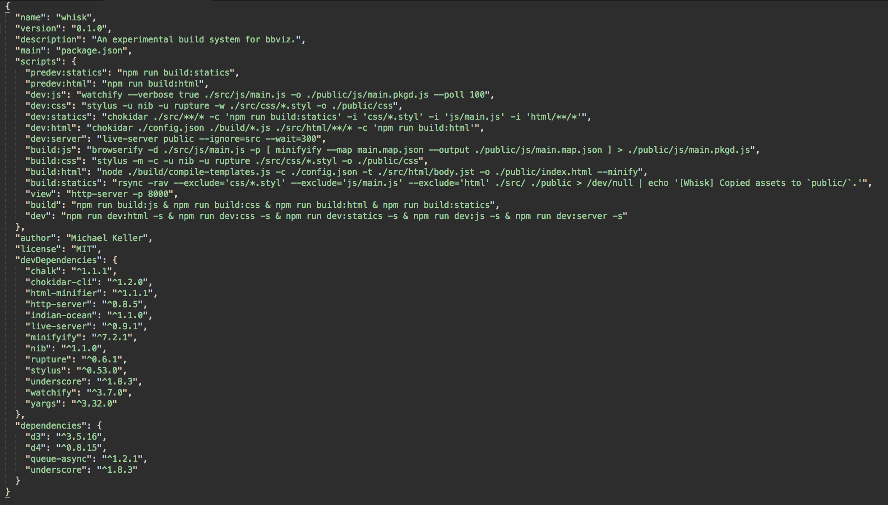
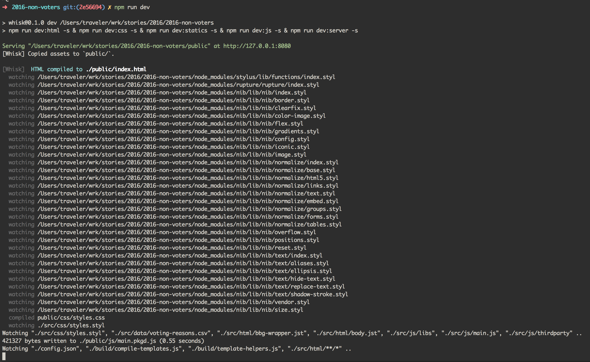
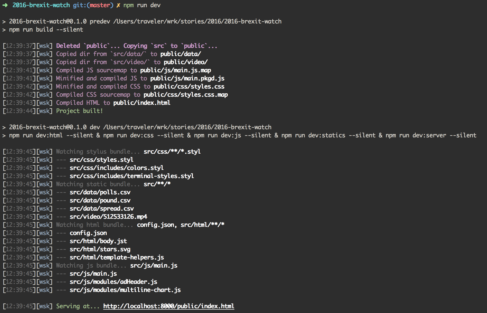
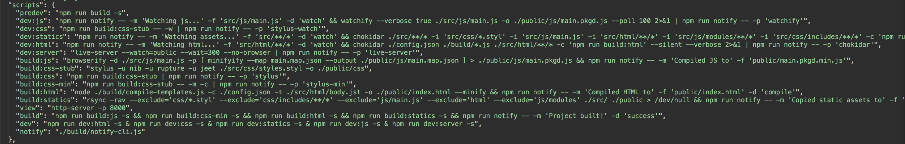

How did we get here?
===

> A brief history of why this project got made

## Our goals

We wanted to make a standardized build system for our projects, which are often one-off graphics that we build as a part of [news stories](https://bloomberg.com/graphics). It had the following requirements (in no particular order):

1. Be flexible and extensible for people on our team unfamiliar with the latest build system frameworks.
2. Provide rich feedback so that if the user did something wrong, it would try to help them correct it. Also make clear what was a problem with **the project** versus a problem with **the build system**. This was critical during the adoption phase.
3. Don't close off possibilities and don't lock us in to one way of doing things. Each of our projects is a custom design. We didn't want a system that constrained creativity or had an architecture that slowed down implementing new features (such as waiting for dependencies to exist or be updated).

## What was out there

The most common choices, at the time, were Gulp and Webpack. We ended up not going with these because they had elements that went against at least one of our three goals.

1. Writing a Gulp plugin, for example, requires knowledge of streams, which is a barrier to entry.
2. Console feedback tells you that a task happened and how long it took but not what it did, specifically.
3. Gulp requires an eco-system of plugins. If you want to use Sass, you rely on `gulp-sass`, which [might not be up to date](https://github.com/dlmanning/gulp-sass/issues/621) or it might introduce its own bugs.
4. Webpack tends to take full ownership over the whole process; breaking off pieces of it or adding to it can be difficult. This might close off possibilities or require us to find "the Webpack way" of doing a given transformation if a project creator wanted it done.

## Where we started

Our first approach in service of these goals was to use vanilla npm scripts and the command-line interfaces for the libraries we wanted to use. We used [chokidar-cli](https://github.com/kimmobrunfeldt/chokidar-cli) to trigger actions when files changed. Our package.json looked like this:

The functionality was okay but we saw very inconsistent console output.

This concern goes beyond aesthetics. If the console is sending differently styled output on change, the user has to interpret multiple signals. This is distracting and makes it harder to recognize actionable feedback.

It would be better if normal compile messages were in a consistent format. Errors should appear in a different color and with a stack trace, if possible, to break up the formatting. The user can detect this change of the corner of his or her eye and attend to it.

Cognitively, the eye is better at noticing movement in the periphery of vision than it is at catching detail. If the build console is in the corner of screen monitor, it's easier to notice a disruption if there's a break from consistency than if you have a number of variable length messages printing all the time.

Since we were implementing a build system where one previously did not exist, clear notifications were important to separate system errors from project errors. It's very easy to blame the new, unknown thing and we wanted to avoid the build system being faulted unnecessarily. In fact, where possible, build notifications should help the user diagnose the problem, more quickly.

## Improving console outputs

The first step in trying to make console outputs more consistent was by piping output to a script that would standardize output from the libraries we were using. Here's the new output:

The problems:

1. This was a lot of work that was likely to change if a library modified its output style
2. It would require more work if we changed libraries, in opposition to goal number one.
3. It made our `package.json` very difficult to read, also in opposition to goal number one for anyone who wanted to edit their npm scripts. Here's what that looked like:

Because each of these scripts handles its output differently, we had to pipe console messages all over the place. Some went to `/dev/null`; others used `2>&1` to redirect stderr to stdout. It was a mess.

## A better setup

These experiments led us to create [wsk](https://github.com/bloomberg/wsk) and [wsk-notify](https://github.com/bloomberg/wsk-notify), which is our current setup. wsk is a watcher specification around [chokidar](https://github.com/paulmillr/chokidar) that makes it easier to declare a glob of files to watch and Vanilla JavaScript modules to run when those files change. wsk-notify is a module for standardized console and desktop notifications.

This setup work with our three goals because:

1. No special knowledge is required to write a task file (a "plugin" using Gulp vocabulary)
2. By using chokidar to watch files, we get access to a diverse set of events. Our notifications can report exactly what events are happening and what tasks it's dispatching as a result.
3. By using libraries directly, we avoid intermediate plugins as much as we can.

Although we passed over using command-line APIs for other reasons, we found that using libraries directly via their JavaScript API also increased the number of options we had when using these target libraries. That makes intuitive sense as you can only squeeze so much functionality into command-line flags.

## Conclusion

We built wsk to address our mix of skills and constraints. It might not be the right solution for everyone but if you've run into issues with stale plugins, being constrained by adding extra concepts into your pipeline, such as streams, or been frustrated when you want to use a new library and have to look for a "How to use with Webpack/Gulp/Grunt" section of the readme, wsk might be helpful for you.

Over the last 18 months of usage, it's proven to be a flexible and maintainable system. Its powered projects as simple as [one-off graphics](https://www.bloomberg.com/graphics/2016-takata-recall/) to [multi-day](https://www.bloomberg.com/politics/graphics/2016-bus-to-november/) or [multi-page](https://www.bloomberg.com/graphics/2016-asia-space-race/) [series](https://www.bloomberg.com/graphics/2017-arctic/) that function more like static-site generators.

You can find usage examples and more documentation on the [wsk](https://bloomberg.github.io/wsk) and [wsk-notify](https://bloomberg.github.io/wsk-notify) sites.
