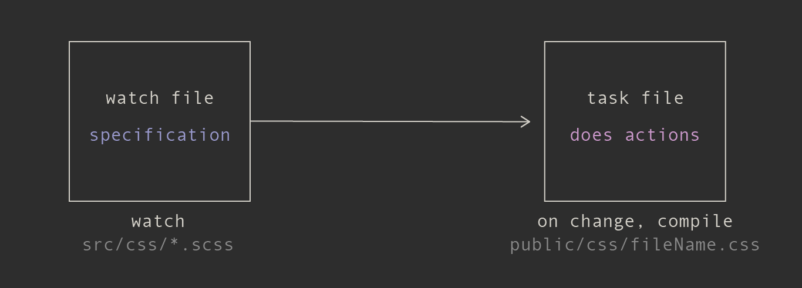
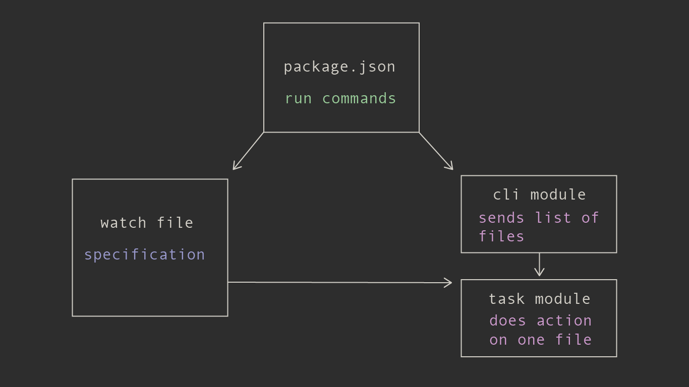
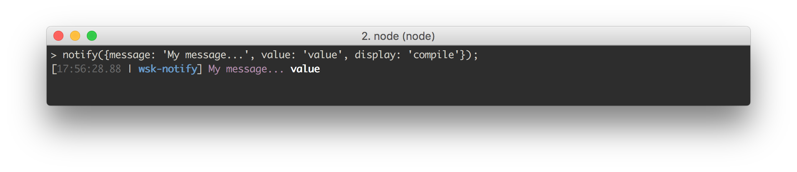
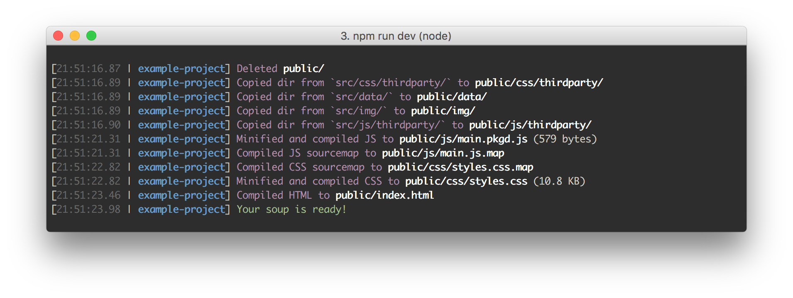
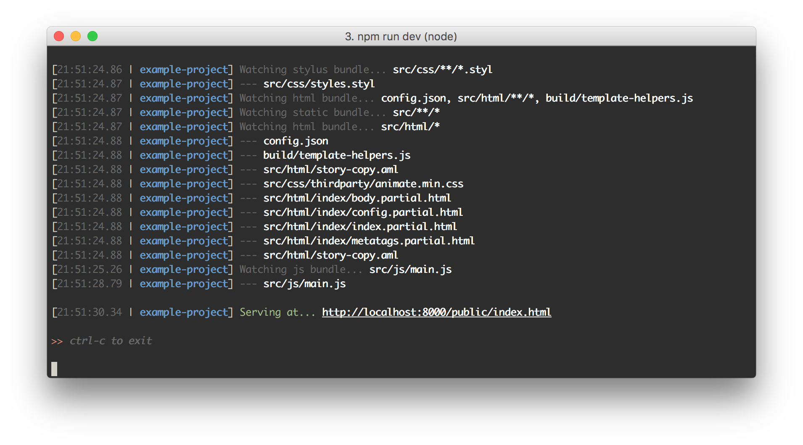

wsk [](https://bloomberg.github.io/wsk)
===

[](https://travis-ci.org/bloomberg/wsk)
[](https://coveralls.io/github/bloomberg/wsk?branch=master)
[](https://www.npmjs.com/package/wsk)
[](https://github.com/Flet/semistandard)

> A straightforward and maintainable build system from the [Bloomberg Graphics team](https://www.bloomberg.com/graphics).

* [Installation](#installation)
* [About](#about)
  - [Built-in Functionality](#built-in-functionality)
  - [Architecture](#architecture)
* [FAQ](#faq)
  - [How is it different?](#how-is-it-different)
  - [What are the advantages?](#what-are-the-advantages)
  - [Why not Gulp?](#why-not-gulp)
  - [Aren't streams useful, though?](#arent-streams-useful-though)
  - [But isn't it faster to load a file with a stream?](#but-isnt-it-faster-to-load-a-file-with-a-stream)
  - [How are task files different from plugins?](#how-are-task-files-different-from-plugins)
  - [Why not Webpack?](#why-not-webpack)
  - [Why not command-line libraries in npm scripts?](#why-not-command-line-libraries-in-npm-scripts)
  - [How did you design wsk?](#how-did-you-design-wsk)
* [Usage](#usage)
  - [Creating A Watch File](#creating-a-watch-file)
    - [Specifying A `targetFile` For An Event](#specifying-a-targetfile-for-an-event)
  - [Creating A Task File](#creating-a-task-file)
  - [Package.json Setup](#packagejson-setup)
  - [Notifying Users](#notifying-users)
* [Roadmap](#roadmap)
* [Contributors](#contributors)
* [License](#license)

## Installation

```
npm install --save wsk
```

## About

wsk is a small JavaScript library combined with a recommended architecture for creating a reliable build system. It was built by the Bloomberg Graphics and Data Journalism team as an open-ended and maintainable solution to building projects. It has allowed us to democratize our build system—allowing the greatest number of people the ability to modify it if need be—and delivers the right level of notification in order to quickly diagnose any JavaScript, CSS or templating errors that may arise.

**[See an example project](https://bloomberg.github.io/wsk.example)**

### Built-in Functionality



At its core, wsk provides a specification around the [chokidar](https://github.com/paulmillr/chokidar) for watching one or more files and declaring scripts to run when those files are created, modified or deleted. The scripts that run are designed to be as arbitrary as possible so that wsk does not lock you into a plugin ecosystem that might get stale or you might want to work outside for a given task.

This design optimizes for maintainability and clarity, without depending on intermediate wrapper plugins.

### Architecture

Since wsk as few built-in opinions, you can configure it multiple ways. Here is one way based on some common build patterns.



Generally, a build system has two modes of operation: **development** and **production**.

In **development** mode, you want to be watching a set of files and when one of them changes, that file should rebuild.

In **production** mode, you're acting across a group of files and building them all.

In this setup, `npm run` commands in `package.json` will initialize watchers when in development mode and build files directly in production mode.

It leverages npm scripts to orchestrate these commands and bash to handle parallelism to avoid reinventing the wheel.

See how this system looks in production by looking at [the example project's source](https://www.github.com/bloomberg/wsk.example).

## FAQ

### How is it different?

Its main differences are that it:

1. recommends project creators use libraries directly through the wsk task file pattern instead of relying on intermediate plugins such as you would in Gulp (e.g. `gulp-sass`, `gulp-live-server`).
2. recommends npm scripts as a consistent and powerful way to orchestrate these task files as opposed to building a task runner into your build system.
3. notifies the user of granular events with pertinent information. With wsk, it's clear how your task processes are interacting with each other and is verbose about any errors.

### What are the advantages?

Through a combination of the above factors, wsk removes itself as much as possible from the list of things that can go wrong during your build. If your build step has an error, you'll have fewer layers to debug and its notifications will help you pinpoint the error more directly.

The code inside of wsk concerns itself with the boring plumbing of watching files and then firing off task events when they've changed. By keeping the core library small and using existing JavaScript and npm patterns, it keeps you focused on what you want your build to do instead of learning wsk-specific concepts.

### Why not Gulp?

Gulp can be great in getting you up to speed creating a project by leveraging the community of plugin developers. This can also be problematic, however, since sometimes plugins aren't well maintained or only work with a certain version of the target library. If plugin design switches between major versions, you might also have to redo a large portion of your system.

This situation can be tricky to debug unless you're fairly familiar with Gulp infrastructure. Having these plugins in your node_modules folder, where they might be written in a different coding styles, also makes it harder for anyone to jump in, diagnose and fix the problem. In some cases, you might have to fork the plugin if the maintainer isn't quick to respond.

Gulp also requires the use of advanced concepts such as streams and vinyl objects. Getting up to speed on the ins and outs of these technologies is non-trivial and introduces cognitive load that could be better spent elsewhere.

Using libraries directly in a wsk task file pattern means you aren't depending on a wrapper plugin of dubious provenance. wsk tasks files are vanilla JavaScript that do not depend on any more advanced programming concepts than event names, file paths and functions.

### Aren't streams useful, though?

Nothing in wsk precludes you from writing your tasks to use streams if you feel it is a better way of reading and writing files. Why Gulp uses streams is worth discussing, though, if you want to decide whether to use them in your project.

Gulp uses streams to avoid the sin of its immediate predecessor, Grunt, of reading and writing intermediate files to disk, which caused very slow builds.

As a solution, Gulp streams are a contract between itself and plugins for handing off files from transformation to transformation. By having a way to pass a file in memory, Gulp is much faster.

The key here is that streams are a means to an end, not the end in itself. As the next section discusses, for most of the file I/O you're doing in a build system, you're not getting a big advantage with streams.

### But isn't it faster to load a file with a stream?

In some cases. It seems that for files [over 10mb this is the case](https://medium.com/@dalaidunc/fs-readfile-vs-streams-to-read-text-files-in-node-js-5dd0710c80ea). But files in your build will be much smaller than that so you're not often getting the efficiencies streams would bring.

if you're loading json files or a similar format that must be read in completely before the transformation can begin, you can't take advantage of a stream's ability to start acting on the file before its fully loaded. In addition, if you're using a Gulp plugin, there's no guarantee that the plugin has actually implemented streams in a way that you're getting the performance benefit unless you do a full code review.

HTML templating is a good example of how you'd have to optimize far down the rabbit hole to get the full benefit (again, your files would still have to be very large). Let's say you are loading in an HTML file that pulls in other HTML partials. Unless those partials are also coming in as streams, the bulk of your markup compilation is most likely using `fs.readFile`.

This is also the case with Rollup, which uses `fs.readFileSync` in [parts of its code](https://github.com/rollup/rollup/blob/9e481d890d333210de3364379b0b1004ee2169f7/src/watch/fileWatchers.js#L69) for example.

gulp-sass, a widely used plugin with over a million monthly downloads [explicitly doesn't support streaming](https://github.com/dlmanning/gulp-sass/blob/035b759f51713e44f7c280f43cd1176e84b0f124/index.js#L26) since its underlying node-sass library requires either [a file path or a string](https://github.com/sass/node-sass/blob/e934a55d5a0433e8e1d483a485c4717c9a416b6c/README.md#file).

Wrapping these libraries in a Gulp plugin doesn't get you around their own internal functionality.

### How are task files different from plugins?

One of the design ideas we've implemented in these example projects is that task files—what would be plugins in a Gulp setup—are committed into each project instead of hosted on npm and required as modules. While this is not mandated by wsk, it has been a helpful practice for our team because it helps avoid some of the issues we've seen with the plugin ecosystems. It might not make sense for your setup and there are some drawbacks, so it's worth discussing.

A convenience of plugins is that it's easier when someone has done the work for you, assuming the work they've done is what you're looking for.

However, canonical plugins can get bloated with complex features you don't need. Or, they become too advanced and incompatible with your version of Node. Also, you might have to wait for a plugin update to support the latest version.

Looking at the library and writing something as close to the "Hello, World" example as possible has been a sensible guideline for us.

There's no reason why you can't write your own Gulp plugins this way, of course. In that scenario, however, your team needs to feel comfortable with Gulp conventions such as Node streams and vinyl objects, so there's larger investment in training. wsk is vanilla JavaScript/Node with no extra learning necessary.

As background, our stories are independent projects that are built from a common scaffold. Committing each task file into the project gives the creator flexibility to make changes without having to 1) make a fork or create a pull request on a registered plugin 2) verify the change won't break previous projects that published without a problem 3) bump the version 4) change the package.json and reinstall. If a change is useful for future projects, such as a bug fix or an API update, we update the project scaffold. Those are rarer events and can happen after the story's deadline.

wsk itself has very few baked in opinions about how plugins/task files must work, leaving possibilities open.

So what *should* a wsk ecosystem look like?

For now, let's say it works more like a template or cookbook where you look at an existing example to get going and implement that pattern in your project with any necessary changes. The [wsk example project](https://github.com/bloomberg/wsk.example/tree/master/build/tasks) has templates for [BrowserSync](https://browsersync.io/), HTML building with [Underscore.js templates](https://underscorejs.org#template), [Rollup](https://rollupjs.org/), [Stylus](https://stylus-lang.com/), [node-sass](https://github.com/sass/node-sass) and static file copying.

### Why not Webpack?

Architecturally, it's much higher level than wsk.

Webpack does a lot of really neat stuff but it's also monolithic; it's hard to break off just a piece of it or swap in something else. Whereas in Webpack, you give your project over to its way of doing things from the JavaScript to the CSS, wsk is designed to have each task file be easily interchangeable.

### Why not command-line libraries in npm scripts?

JavaScript APIs expose more functionality than their command-line interfaces. Thus making a task file gives you more control than stringing command line arguments into an npm script. Command-line interfaces can make your `package.json` difficult to read and are tricky to comment and scale. Also, your notifications will all be in different styles at different levels of log specificity, which will confuse the user and make it more difficult to spot errors.

### How did you design wsk?

Check out our [HOW-DID-WE-GET-HERE.md](https://github.com/bloomberg/wsk/blob/master/HOW-DID-WE-GET-HERE.md) document to read the illustrated journey.

## Usage

### Creating A Watch File

In a wsk project, the idea is you have **files to watch** and **tasks that are run** when certain events happen to those files. You configure this relationship with a watcher file. Here's an example schema with defaults shown. Required fields are `serviceName`, `path` and an `events` array.

```js
// Watch file

var watcher = require('wsk').watcher;

// This can be an object or an array of objects
var watchGroups = [
  {
    serviceName: 'stylus', // Give this watcher a name so we can use it to notify project creators what is happening
    path: 'src/css/**/*.styl', // A glob or an array of globs
    ignoreDotFiles: true, // Defaults to ignoring files that start with a `.`.
    chokidarOptions: { // Any options that can be passed to chokidar https://github.com/paulmillr/chokidar#api
      ignoreInitial: true
    },
    warnIfMissingPath: true, // By default, wsk will warn you (but proceed normally) if you have entered a non-glob path (or an array that contains a non-glob path) for a file that does not exist. This is because it's easy to get file paths wrong and it's nice to be told so. Sometimes, you will be watching a non-existent file by design. So, you can disable this warning by setting this to `false`.
    displayOptions: {
      hideAll: false, // Toggle the notification of what is being watched.
      hideChildFiles: false, // If path is a glob, toggle whether to show files in that glob
      hideChildDirs: false // If path is a glob, toggle whether to show directories in that glob
      // `hideAll` is different from setting both `hideChildFiles` and `hideChildDirs` are `true` because in the latter case, the bundle notification will still display.
    },
    // Specify an array of events that will be listened to and the files that will be run when those events occur. This array is empty by default.
    // Event types can be anything that chokidar supports: https://github.com/paulmillr/chokidar#methods--events
    events: [
      {
        type: 'change',
        taskFiles: 'path/to/stylus-build.js',
        options: {
          myOption: true // You can pass an options object which will be the third argument to the task file's `onEvent` function.
        }
      },
      {
        type: 'add',
        taskFiles: ['path/to/stylus-build.js', 'path/to/other-task.js'],
        commands: ['python path/to/python.py'],
        env: {
          myEnvVariable: true // Same thing to `options` for task files except these get sent to `process.env` object.
        }
      },
      {
        type: 'unlink',
        taskFiles: 'path/to/stylus-build.js',
        commands: 'npm run other-task'
      }
    ]
  }
];

// Add this watch group, will return an error or at list of the chokidar .getWatched() objects on done
watcher.add(watchGroups, function (err, watchTrees) {
  if (err) {
    console.error(err);
    return;
  }
  // An array of directory tree objects for every watchGroup.
  // If you've passed an array of watchGroups, the callback happens after they are all done
  console.log(watchTree);
  /*
  [{
    'src/css': [ 'styles.styl', 'embed.styl' ],
    'src/css/modules': [ 'colors.styl' ]
  }]
  */
});
```

**Note:** wsk uses [chokidar](https://npmjs.org/package/chokidar) for its event watching, which [supports](https://github.com/paulmillr/chokidar#methods--events) the following events:

> `add`, `addDir`, `change`, `unlink`, `unlinkDir`, `ready`, `raw`, `error`. Additionally `all` is available which gets emitted with the underlying event name and path for every event other than `ready`, `raw`, and `error`.

#### Specifying A `targetFile` For An Event

Your event configurations can also specify replacement or additional files to be acted on. This can be useful if you want to delete a corresponding sourcemap if a CSS file is deleted, for example.

```js
// within the events array...
{
  type: 'unlink',
  taskFiles: 'path/to/unlink.js',
  // this can also be a single string
  targetFiles: [
    'public/css/styles.css',
    'public/css/styles.css.map'
  ]
}

// or give it a function that gets passed the file that triggered the event

{
  type: 'unlink',
  taskFiles: 'path/to/unlink.js',
  targetFiles: function (filePath) {
    // filePath is the deleted file `src/css/filename.scss
    var outPath = filePath.replace('src', 'public').replace('.scss', '.css')
    return [
      outPath,
      outPath + '.map'
    ] // This can return a string or an array
  }
}
```

### Creating A Task File

Here is a basic task file setup. Its `onEvent` function runs whenever the files specified in the watch file `path` glob has the specified action.

```js
// Task file

// Load our notification module
var notify = require('wsk').notify;

// To run on an event specified in your watcher, the must export an `onEvent` function.
// This function gets passed three arguments:
// `eventType`, name of the event specified in your watch file
// `changedPath` is the path to the changed file or directory
// An optional `options` hash that comes from the watcher event specification.
function onEvent (eventType, changedPath, options) {
  // Here write Sass JavaScript API code to transform this file...

  // Log out what we're doing to the user
  notify({
    message: 'We did something to this file:',
    value: changedPath,
    display: 'compile'
  });
}

// Export a public function called `onEvent`, which is what watcher expects
module.exports = {
  onEvent: onEvent
};
```

See the [wsk example project](https://github.com/bloomberg/wsk.example/tree/master/build/tasks) for more examples.

### Package.json Setup

In this pattern, you run your watch files with an npm command such as `npm run dev` and build your project with `npm run build`. You can configure your scripts however you like but these docs will discuss the conventions in our example.

Each dev command starts with `dev:` and points to watcher files. Build commands start with `build:` and point to build task files. We add a `predev` tasks that builds your files every time you start up the dev process.

```json
{
  "scripts": {
    "dev:css": "node build/tasks/watch-css.js",
    "dev:js": "node build/tasks/watch-js.js",
    "dev:html": "node build/tasks/watch-html.js",
    "build:css": "node build/tasks/build-css.js",
    "build:js": "node build/tasks/build-js.js",
    "build:html": "node build/tasks/build-html.js",
    "dev": "npm run dev:css --silent && npm run dev:js --silent && npm run dev:html --silent",
    "build": "npm run build:css --silent && npm run build:js --silent && npm run build:html --silent",
    "predev": "npm run build --silent"
  }
}
```

**Note:** The `--silent` flag is optional but including it will make your console output more readable and easier to follow along with. It supresses boilerplate npm output.

### Notifying Users

wsk uses the [wsk-notify](https://github.com/bloomberg/wsk-notify) library to handle styling. One cool thing to point out is that errors appear as desktop notifications, which is very helpful.

You can take a look at [the wsk-notify documentation](https://bloomberg.github.io/wsk-notify) for full options and styles. The basic usage is as follows:

```js
var notify = require('wsk').notify;

notify({
  message: 'My message...',
  value: 'value',
  display: 'compile' // Can be any of the following: 'add', 'change', 'compile', 'error', 'reload', 'remove', 'serve', 'success', 'watch' or 'warn'
});
```

The basic compile display style looks like this:



Here what `npm run build` gives you:



And here is what `npm run dev` gives you:



## Roadmap

Here are features that we would like to integrate into future versions of wsk.

1. Dependency tree creation. It would be nice if the user could supply a function that defines a way to find dependency in a given file. This could be either by getting passed an AST or through simple string matching. For example, if you always read templates through a `h.readTemplate` function, you could extract those files recursively.
2. Pass in a clock object or timestamp to a taskfile for easy timing.
3. Set up a "Resolved" notification style so you can know that your error was fixed via desktop notification.

## Contributors

* [Michael Keller](https://twitter.com/mhkeller)
* [Jeremy Diamond](https://twitter.com/_jsdiamond)
* [Blacki Migliozzi](https://twitter.com/blackili)

## License

Apache-2.0
